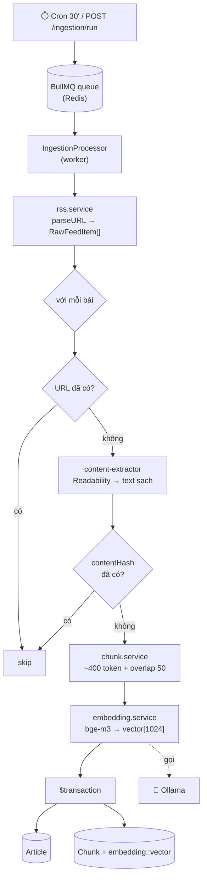
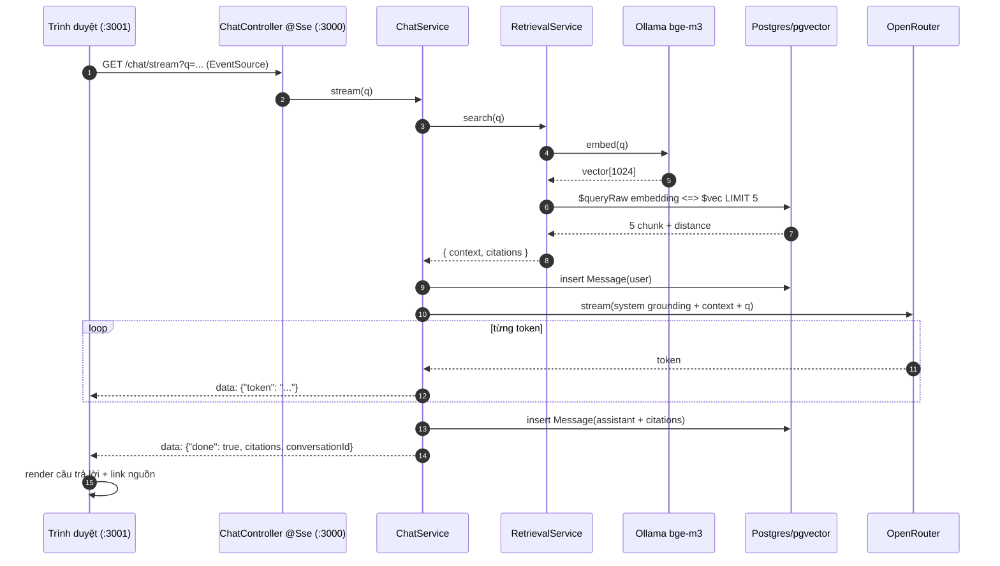

# NewsQA — Luồng nghiệp vụ end-to-end (kèm code xử lý)

> Tài liệu này đi qua TỪNG BƯỚC của hệ thống, kèm code thật ở mỗi mắt xích. Đọc cùng [ONBOARDING.md](ONBOARDING.md).
>
> Hệ thống có **2 pha tách biệt**:
> - **PHA A — Nạp dữ liệu** (nền, định kỳ): biến tin tức thành vector lưu vào DB.
> - **PHA B — Hỏi-đáp** (real-time): tìm vector liên quan → LLM trả lời kèm trích dẫn.

---

# PHA A — NẠP DỮ LIỆU (Ingestion)

Kích hoạt bởi cron (mỗi 30') hoặc thủ công `POST /ingestion/run`. Mỗi feed chạy qua `ingestFeed → ingestArticle`.

## A0. Lịch trình & hàng đợi — `ingestion.scheduler.ts`

Khi app khởi động, scheduler đăng ký job lặp cho từng feed vào BullMQ (Redis):

```ts
async onModuleInit(): Promise<void> {
  console.log('IngestionScheduler: Initializing...');
  await this.queue.drain(); // Clear old jobs
  for (const feed of DEFAULT_FEEDS) {
    await this.queue.add(JOB_FETCH_FEED, feed, {
      repeat: { every: 30 * 60 * 1000 },   // lặp mỗi 30 phút
      jobId: `feed:${feed.id}`,
      removeOnComplete: true,
      removeOnFail: 50,
    });
  }
}
```

`IngestionProcessor` (BullMQ Worker) nhận job và gọi service:

```ts
@Processor(INGESTION_QUEUE)
export class IngestionProcessor extends WorkerHost {
  async process(job: Job<FeedSource>): Promise<void> {
    if (job.name === JOB_FETCH_FEED) {
      await this.ingestion.ingestFeed(job.data);
    }
  }
}
```

> **Tại sao dùng hàng đợi?** Để nạp chạy nền, không chặn request; tự retry; và cron hoá việc cập nhật tin.

## A1. Tải & parse RSS — `rss.service.ts`

```ts
async fetchFeed(feed: FeedSource): Promise<RawFeedItem[]> {
  const parsed = await this.parser.parseURL(feed.url);
  const items = (parsed.items ?? [])
    .filter((i) => i.link && i.title)
    .map((i) => ({
      url: i.link!.trim(),
      title: i.title!.trim(),
      source: feed.name,
      publishedAt: i.isoDate ? new Date(i.isoDate) : null,
      summaryHtml: i['content:encoded'] ?? i.content ?? i.contentSnippet ?? '',
    }));
  this.logger.log(`Feed ${feed.id}: ${items.length} items`);
  return items;
}
```

Kết quả: danh sách `RawFeedItem` (~50 bài/feed). `summaryHtml` là phương án dự phòng nếu không tải được full bài.

## A2 → A8. Xử lý một bài — `ingestion.service.ts`

Đây là trái tim của PHA A. Đọc kỹ các comment:

```ts
async ingestArticle(item: RawFeedItem): Promise<'inserted' | 'skipped'> {
  // (A3) Chống trùng lần 1: URL đã có thì bỏ ngay — KHÔNG tốn công bóc/embed
  if (await this.prisma.article.findUnique({ where: { url: item.url } })) {
    return 'skipped';
  }

  // (A4) Bóc text sạch từ HTML bài gốc (Readability), fallback summaryHtml
  const content = await this.extractor.extract(item.url, item.summaryHtml);
  if (!content) return 'skipped';

  // (A5) Chống trùng lần 2: hash nội dung — bắt bài trùng nhưng khác URL
  const contentHash = createHash('sha256').update(content).digest('hex');
  if (await this.prisma.article.findUnique({ where: { contentHash } })) {
    return 'skipped';
  }

  // (A6) Cắt thành các đoạn ~400 token
  const chunks = this.chunker.chunk(content);
  if (chunks.length === 0) return 'skipped';

  // (A7) Embed TẤT CẢ đoạn trong 1 lần gọi (batch) -> mảng vector 1024 chiều
  const vectors = await this.embedding.embedBatch(chunks.map((c) => c.content));

  // (A8) Ghi Article + các Chunk trong 1 transaction (all-or-nothing)
  await this.prisma.$transaction(async (tx) => {
    const article = await tx.article.create({
      data: {
        url: item.url, title: item.title, source: item.source,
        publishedAt: item.publishedAt ?? undefined, content, contentHash,
      },
    });
    for (let i = 0; i < chunks.length; i++) {
      const c = chunks[i];
      // Prisma KHÔNG ghi được cột vector -> dùng raw SQL với literal ::vector
      // id tự sinh bằng cuid2 vì raw INSERT không qua @default(cuid()) của Prisma
      await tx.$executeRaw`
        INSERT INTO "Chunk" ("id","articleId","ord","content","tokenCount","embedding","createdAt")
        VALUES (${createId()}, ${article.id}, ${c.ord}, ${c.content}, ${c.tokenCount},
                ${toVectorLiteral(vectors[i])}::vector, now())`;
    }
  });
  return 'inserted';
}
```

Với `toVectorLiteral` biến `[0.12, -0.34, ...]` (1024 số) thành chuỗi `'[0.12,-0.34,...]'` để cast `::vector`:

```ts
const toVectorLiteral = (v: number[]) => `[${v.join(',')}]`;
```

### A6 chi tiết — Cắt đoạn `chunk.service.ts`

Thuật toán cửa sổ trượt theo token, có chồng lấn (overlap) để không mất ngữ cảnh ở ranh giới:

```ts
const MAX_TOKENS = 400;
const OVERLAP_TOKENS = 50;

chunk(text: string): TextChunk[] {
  const clean = text.replace(/\s+/g, ' ').trim();
  if (!clean) return [];
  const words = clean.split(' ');
  const chunks: TextChunk[] = [];
  let ord = 0, start = 0;
  while (start < words.length) {
    // gom từ tới khi chạm trần 400 token
    let end = start, tokenCount = 0;
    while (end < words.length) {
      const next = encode(words[end] + ' ').length;  // đếm token bằng gpt-tokenizer
      if (tokenCount + next > MAX_TOKENS) break;
      tokenCount += next; end++;
    }
    if (end === start) end = start + 1;               // 1 từ siêu dài -> vẫn tiến
    const content = words.slice(start, end).join(' ');
    chunks.push({ ord: ord++, content, tokenCount: encode(content).length });
    if (end >= words.length) break;
    // lùi lại để đoạn sau chồng lấn ~25 từ với đoạn trước
    const overlapWords = Math.min(end - start, Math.ceil(OVERLAP_TOKENS / 2));
    start = end - overlapWords;
  }
  return chunks;
}
```

> **Vì sao chunk?** Bài báo dài, nhưng truy hồi cần đơn vị nhỏ để (a) embed chính xác, (b) chỉ lấy đúng đoạn liên quan vào prompt, tiết kiệm token LLM.

### A7 chi tiết — Embedding `embedding.service.ts`

Gọi Ollama `bge-m3`, **fail cứng nếu sai 1024 chiều** (chống làm hỏng cột vector):

```ts
async embedBatch(texts: string[]): Promise<number[][]> {
  if (texts.length === 0) return [];
  const res = await fetch(`${this.baseUrl}/api/embed`, {
    method: 'POST',
    headers: { 'Content-Type': 'application/json' },
    body: JSON.stringify({ model: this.model, input: texts }),
  });
  if (!res.ok) throw new Error(`Embedding request failed (${res.status} ...)`);
  const data = (await res.json()) as OllamaEmbedResponse;
  const embeddings = data.embeddings;
  if (!Array.isArray(embeddings) || embeddings.length !== texts.length) {
    throw new Error(`Embedding response shape mismatch ...`);
  }
  for (const vector of embeddings) {
    if (vector.length !== this.dim) {           // this.dim = 1024
      throw new Error(`Embedding dimension mismatch: got ${vector.length}, expects ${this.dim}`);
    }
  }
  return embeddings;
}
```

**Kết quả PHA A:** mỗi bài → 1 row `Article` + N row `Chunk`, mỗi chunk mang 1 vector 1024 chiều. Đây là toàn bộ "kiến thức" hệ thống dùng để trả lời.

---

# PHA B — HỎI-ĐÁP (Real-time RAG)

Một câu hỏi đi qua 8 bước. Điểm vào là controller SSE.

## B1. Điểm vào HTTP — `chat.controller.ts`

```ts
@Controller('chat')
export class ChatController {
  @Sse('stream')                                  // Server-Sent Events
  stream(
    @Query('q') q: string,
    @Query('conversationId') conversationId?: string,
  ): Observable<MessageEvent> {
    return this.chat.stream(q, conversationId);   // trả Observable -> Nest tự stream
  }
}
```

> `@Sse` của NestJS biến một `Observable<MessageEvent>` thành luồng SSE: mỗi `sub.next(...)` = một dòng `data:` đẩy về trình duyệt.

## B2 → B8. Điều phối — `chat.service.ts`

Toàn bộ vòng đời một câu trả lời nằm ở đây:

```ts
stream(question: string, conversationId?: string): Observable<MessageEvent> {
  return new Observable<MessageEvent>((sub) => {
    (async () => {
      // (B2+B3+B4) Truy hồi: embed câu hỏi -> tìm 5 chunk -> dựng context + citations
      const { context, citations } = await this.retrieval.search(question);

      // tạo hội thoại mới (hoặc dùng lại) — lấy 80 ký tự đầu làm tiêu đề
      const convo = conversationId
        ? { id: conversationId }
        : await this.prisma.conversation.create({ data: { title: question.slice(0, 80) } });

      // (B5) lưu câu hỏi của user
      await this.prisma.message.create({
        data: { conversationId: convo.id, role: 'user', content: question },
      });

      // (B6) gọi LLM, stream từng token NGAY khi tới
      let answer = '';
      for await (const token of this.llm.streamAnswer(question, context)) {
        answer += token;
        sub.next({ data: { token } } as MessageEvent);     // -> đẩy về UI
      }

      // (B7) lưu câu trả lời + citations (cột Json cần cast)
      await this.prisma.message.create({
        data: {
          conversationId: convo.id, role: 'assistant', content: answer,
          citations: citations as unknown as Prisma.InputJsonValue,
        },
      });

      // (B8) sự kiện cuối: báo xong + gửi citations + id hội thoại
      sub.next({ data: { done: true, citations, conversationId: convo.id } } as MessageEvent);
      sub.complete();
    })().catch((err) => sub.error(err));
  });
}
```

## B2+B3+B4 chi tiết — Truy hồi `retrieval.service.ts`

```ts
async search(question: string, k = 5): Promise<RetrievalResult> {
  // (B2) embed câu hỏi bằng ĐÚNG model bge-m3 đã dùng lúc nạp
  const vec = await this.embedding.embed(question);
  const literal = `[${vec.join(',')}]`;

  // (B3) tìm k chunk gần nghĩa nhất bằng toán tử cosine <=> của pgvector
  const rows = await this.prisma.$queryRaw<RetrievedChunk[]>(Prisma.sql`
    SELECT c."content",
           a."id"     AS "articleId",
           a."url", a."title", a."source",
           (c."embedding" <=> ${literal}::vector) AS "distance"
    FROM "Chunk" c
    JOIN "Article" a ON a."id" = c."articleId"
    WHERE c."embedding" IS NOT NULL
    ORDER BY c."embedding" <=> ${literal}::vector   -- càng nhỏ càng gần nghĩa
    LIMIT ${k}
  `);

  // (B4) dựng context + citations
  return buildContext(rows);
}
```

> `<=>` là **cosine distance** của pgvector. `ORDER BY ... LIMIT 5` = lấy 5 đoạn có nghĩa gần câu hỏi nhất. Trong demo, distance ~0.56 và tăng dần.

### B4 chi tiết — Dựng ngữ cảnh `context.builder.ts`

Hàm thuần (pure), đã unit-test. Đánh số đoạn `[1..n]` và **gom citations theo bài** (mỗi bài chỉ 1 nguồn dù có nhiều chunk):

```ts
export function buildContext(rows: RetrievedChunk[]): RetrievalResult {
  if (rows.length === 0) return { context: '', citations: [] };

  // đánh số mỗi đoạn -> "[1] nội dung...\n\n[2] ..."
  const context = rows.map((r, i) => `[${i + 1}] ${r.content}`).join('\n\n');

  // gom nguồn duy nhất theo articleId (giữ index của lần xuất hiện đầu)
  const seen = new Map<string, Citation>();
  rows.forEach((r, i) => {
    if (!seen.has(r.articleId)) {
      seen.set(r.articleId, {
        index: i + 1, articleId: r.articleId, url: r.url, title: r.title, source: r.source,
      });
    }
  });
  return { context, citations: [...seen.values()] };
}
```

## B6 chi tiết — LLM & Prompt

### Prompt grounding nghiêm — `qa.prompt.ts`

Đây là "luật chơi" ép LLM không bịa:

```ts
export function buildQaMessages(question: string, context: string) {
  const system = new SystemMessage(
    [
      'Bạn là trợ lý hỏi-đáp tin tức tiếng Việt.',
      'CHỈ trả lời dựa trên NGỮ CẢNH được cung cấp.',
      'Nếu ngữ cảnh không chứa câu trả lời, nói: "Tôi không tìm thấy thông tin này trong các nguồn hiện có."',
      'Luôn trích dẫn nguồn bằng [số] tương ứng với đoạn ngữ cảnh đã dùng.',
      'Không bịa thông tin.',
    ].join(' '),
  );
  const human = new HumanMessage(`NGỮ CẢNH:\n${context}\n\nCÂU HỎI: ${question}`);
  return [system, human];
}
```

### Stream + fallback — `llm.service.ts`

```ts
constructor(config: ConfigService) {
  const base = {
    apiKey: config.getOrThrow<string>('OPENROUTER_API_KEY'),
    configuration: {
      baseURL: config.get('OPENROUTER_BASE_URL', 'https://openrouter.ai/api/v1'),
      defaultHeaders: { 'HTTP-Referer': ..., 'X-Title': ... },
    },
    temperature: 0.2,      // thấp -> bám sát ngữ cảnh, ít sáng tạo
    streaming: true,
    maxRetries: 1,         // fail nhanh khi model :free bị 429 -> nhảy fallback
  };
  const primary  = new ChatOpenAI({ ...base, model: config.getOrThrow('LLM_PRIMARY_MODEL') });
  const fallback = new ChatOpenAI({ ...base, model: config.getOrThrow('LLM_FALLBACK_MODEL') });
  this.model = primary.withFallbacks([fallback]) as unknown as ChatOpenAI;
}

async *streamAnswer(question: string, context: string): AsyncIterable<string> {
  const stream = await this.model.stream(buildQaMessages(question, context));
  for await (const chunk of stream) {
    const text = typeof chunk.content === 'string' ? chunk.content : '';
    if (text) yield text;     // nhả từng token cho ChatService đẩy ra SSE
  }
}
```

> `withFallbacks` + `maxRetries:1`: nếu model chính 429 (rate-limit), tự chuyển model dự phòng thay vì treo. `temperature:0.2` giảm ảo giác.

---

# PHA B (tiếp) — FRONTEND nhận stream

## B1/B6/B8 phía trình duyệt — `web/src/lib/useChatStream.ts`

```ts
function send(q: string) {
  const question = q.trim();
  if (!question || streaming) return;

  // thêm bong bóng user + 1 bong bóng assistant rỗng để fill dần
  setMessages((m) => [...m, { role: 'user', content: question }, { role: 'assistant', content: '' }]);
  setStreaming(true);

  // (B1) mở SSE tới backend
  const url = `${process.env.NEXT_PUBLIC_API_URL}/chat/stream?q=${encodeURIComponent(question)}`;
  const es = new EventSource(url);

  es.onmessage = (e) => {
    const data = JSON.parse(e.data);
    if (data.token) {
      // (B6) nối token vào bong bóng assistant cuối -> chữ hiện dần
      setMessages((m) => {
        const copy = [...m];
        const last = copy[copy.length - 1];
        copy[copy.length - 1] = { ...last, content: last.content + data.token };
        return copy;
      });
    } else if (data.done) {
      // (B8) gắn citations + đóng kết nối
      setMessages((m) => {
        const copy = [...m];
        copy[copy.length - 1] = { ...copy[copy.length - 1], citations: data.citations };
        return copy;
      });
      setStreaming(false);
      es.close();
    }
  };
  es.onerror = () => { setStreaming(false); es.close(); };
}
```

## Render — `web/src/app/page.tsx` (rút gọn)

```tsx
{messages.map((m, i) => (
  <div key={i} className={m.role === 'user' ? 'flex justify-end' : 'flex justify-start'}>
    <div className={m.role === 'user' ? 'bong-bóng-user' : 'bong-bóng-assistant'}>
      <p className="whitespace-pre-wrap">{m.content}</p>

      {/* nguồn trích dẫn -> link ra bài gốc */}
      {m.citations?.map((c) => (
        <li key={c.index}>
          <a href={c.url} target="_blank">[{c.index}] {c.title}</a>
          <span>({c.source})</span>
        </li>
      ))}
    </div>
  </div>
))}
```

---

# Sơ đồ Mermaid

## PHA A — Pipeline nạp dữ liệu



## PHA B — Một câu hỏi (sequence)



---

# Ví dụ payload thật (capture từ demo)

Câu hỏi: **"Vietnam Airlines đặt mục tiêu lợi nhuận bao nhiêu năm nay?"**

### 1) RSS item sau parse (`RawFeedItem`)
```json
{
  "url": "https://vnexpress.net/vietnam-airlines-van-dat-muc-tieu-co-lai-nam-nay-5090717.html",
  "title": "Vietnam Airlines vẫn đặt mục tiêu có lãi năm nay",
  "source": "VnExpress - Tin mới nhất",
  "publishedAt": "2026-06-28T05:45:11.000Z",
  "summaryHtml": "<p>Dù giá nhiên liệu bay Jet A1 neo cao...</p>"
}
```

### 2) Một `TextChunk` sau khi cắt
```json
{ "ord": 0, "content": "Vietnam Airlines vẫn đặt mục tiêu có lãi năm nay Dù giá nhiên liệu bay Jet A1 neo cao...", "tokenCount": 312 }
```

### 3) Vector embedding (rút gọn — thực tế 1024 số)
```json
[0.0123, -0.0345, 0.0512, ... , -0.0071]   // length = 1024
```

### 4) Kết quả truy hồi — rows từ `$queryRaw` (đã sắp theo distance tăng dần)
```json
[
  { "content": "Vietnam Airlines vẫn đặt mục tiêu...", "articleId": "cmqxdyndi000dvbncpxl4bscs",
    "url": "https://vnexpress.net/...-5090717.html", "title": "Vietnam Airlines vẫn đặt mục tiêu có lãi năm nay",
    "source": "VnExpress - Tin mới nhất", "distance": 0.5666 },
  { "...": "...", "distance": 0.5673 },
  { "...": "...", "distance": 0.5726 }
]
```

### 5) `RetrievalResult` sau `buildContext`
```json
{
  "context": "[1] Vietnam Airlines vẫn đặt mục tiêu có lãi năm nay Dù giá nhiên liệu...\n\n[2] ...",
  "citations": [
    { "index": 1, "articleId": "cmqxdyndi000dvbncpxl4bscs",
      "url": "https://vnexpress.net/...-5090717.html",
      "title": "Vietnam Airlines vẫn đặt mục tiêu có lãi năm nay",
      "source": "VnExpress - Tin mới nhất" }
  ]
}
```

### 6) Luồng SSE thật trên dây (`curl -N`)
```
id: 1
data: {"token":"Vietnam Airlines"}

id: 2
data: {"token":" đặt mục tiêu lợi"}

id: 3
data: {"token":" nhuận hợp nhất"}

id: 4
data: {"token":" khoảng **510 "}

id: 5
data: {"token":"tỷ đồng**"}

id: 6
data: {"token":" cho cả năm nay"}

id: 7
data: {"token":". [1]"}

id: 8
data: {"done":true,"citations":[{"index":1,"articleId":"cmqxdyndi000dvbncpxl4bscs","url":"https://vnexpress.net/vietnam-airlines-van-dat-muc-tieu-co-lai-nam-nay-5090717.html","title":"Vietnam Airlines vẫn đặt mục tiêu có lãi năm nay","source":"VnExpress - Tin mới nhất"}],"conversationId":"cmqximiur000hvbhwlnjhbr82"}
```

### 7) Hàng đã lưu trong DB
```
Conversation: { id: "cmqximiur000hvbhwlnjhbr82", title: "Vietnam Airlines đặt mục tiêu lợi nhuận bao nhiêu năm nay?" }
Message(user):      { role: "user",      content: "Vietnam Airlines...", citations: null }
Message(assistant): { role: "assistant", content: "Vietnam Airlines đặt mục tiêu lợi nhuận 510 tỷ đồng cho năm nay. [1]",
                      citations: [{ index: 1, ... }] }
```

---

# Sơ đồ tổng — một câu hỏi đi qua đâu

```
Trình duyệt :3001                Backend NestJS :3000               Dịch vụ
─────────────────                ────────────────────               ───────
useChatStream.send()
  │ EventSource
  └─ GET /chat/stream?q= ───────► ChatController.@Sse
                                   └─ ChatService.stream()
                                       ├─ RetrievalService.search()
                                       │    ├─ embedding.embed(q) ───► Ollama bge-m3
                                       │    └─ $queryRaw  <=>  LIMIT5 ─► Postgres/pgvector
                                       ├─ buildContext()  [1..n]+nguồn
                                       ├─ prisma.message.create(user) ─► Postgres
                                       ├─ llm.streamAnswer(q, context)─► OpenRouter (stream)
  token ◄═══════════════════════════════ sub.next({token}) ◄──────────┘
  token ◄═══════════════════════════════ ...
  (chữ hiện dần)
                                       ├─ prisma.message.create(assistant+citations)
  {done, citations} ◄═══════════════════ sub.next({done})
  (render link nguồn)                    └─ sub.complete()
```

---

# Tóm tắt vai trò từng file

| File | Vai trò trong luồng |
|---|---|
| `ingestion/scheduler` | (A0) cron đẩy job nạp mỗi 30' |
| `ingestion/processor` | (A0) worker chạy job |
| `ingestion/rss.service` | (A1) tải + parse RSS |
| `ingestion/content-extractor` | (A4) HTML → text sạch |
| `ingestion/chunk.service` | (A6) cắt đoạn ~400 token |
| `embedding/embedding.service` | (A7,B2) text → vector 1024 (bge-m3) |
| `ingestion/ingestion.service` | (A2-A8) chống trùng + orchestrate + ghi vector |
| `retrieval/retrieval.service` | (B2,B3) embed câu hỏi + vector search |
| `retrieval/context.builder` | (B4) đánh số đoạn + gom citations |
| `llm/qa.prompt` | (B6) prompt grounding nghiêm |
| `llm/llm.service` | (B6) stream LLM + fallback |
| `chat/chat.service` | (B2-B8) điều phối toàn bộ + lưu DB |
| `chat/chat.controller` | (B1) endpoint SSE |
| `web/lib/useChatStream` | (B1,B6,B8) EventSource phía client |
| `web/app/page.tsx` | render chat + citations |
```
